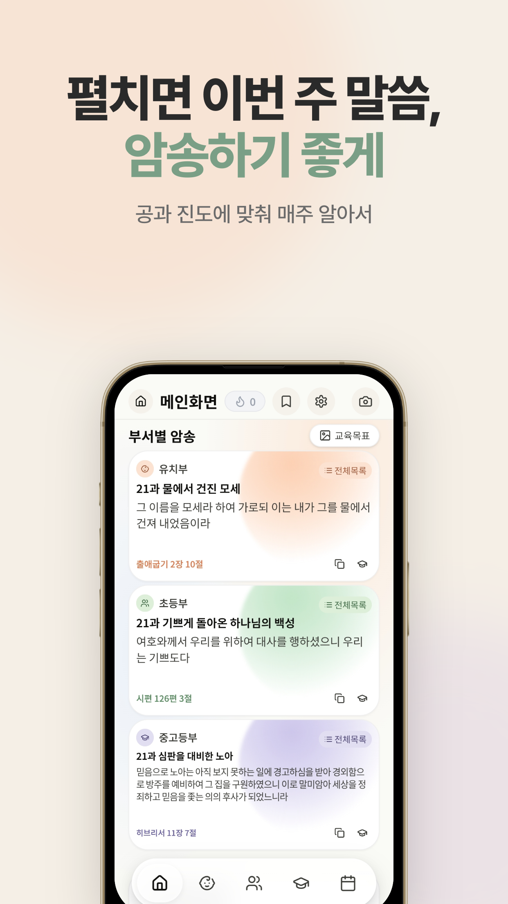
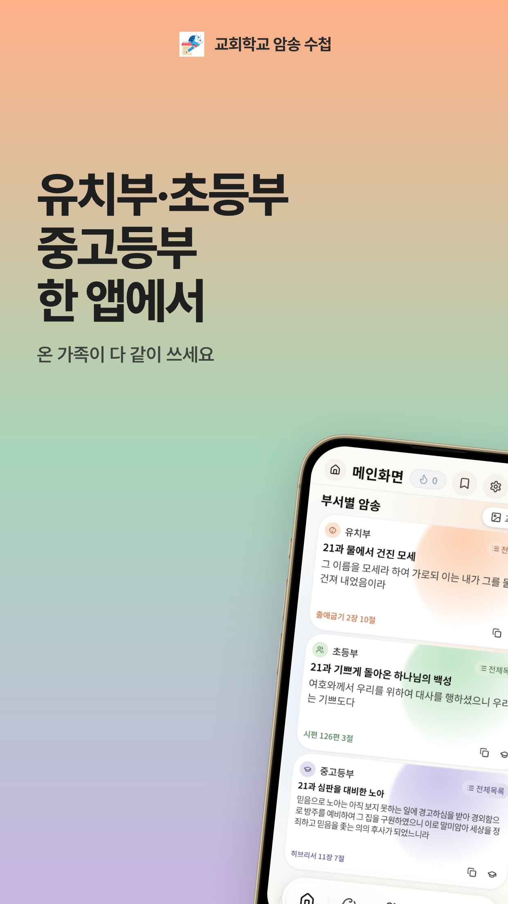
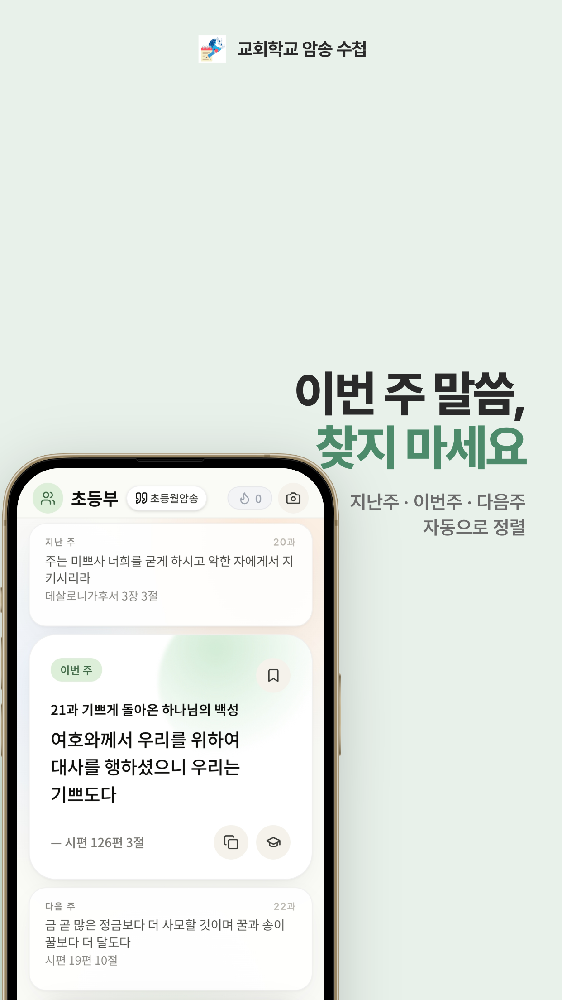
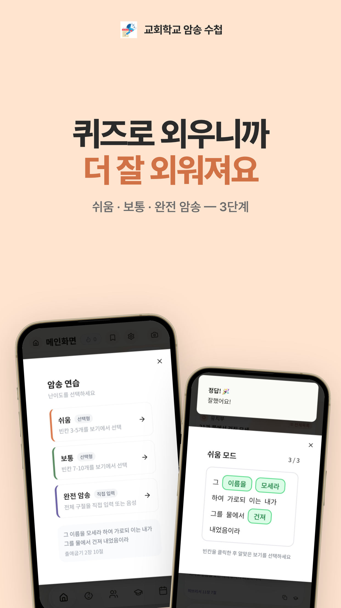
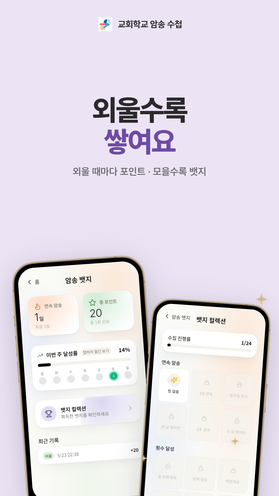
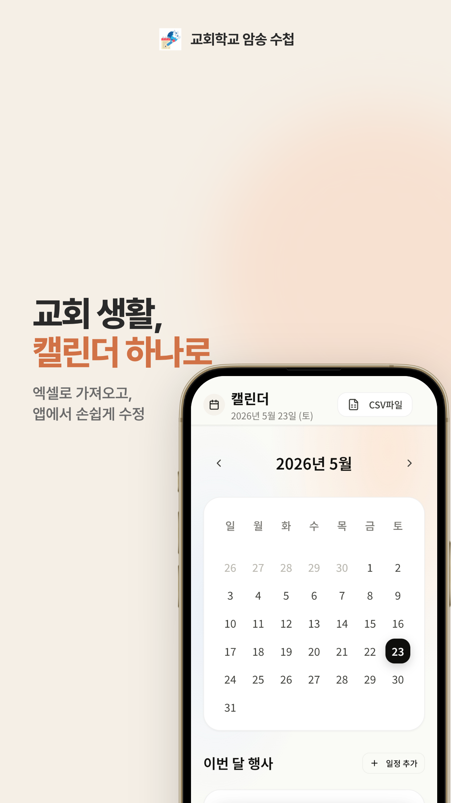

<p align="center">
  
</p>

<h1 align="center">교회학교 암송 수첩</h1>

<p align="center">
  <b>유치부·초등부·중고등부 주간 말씀 암송 앱</b><br/>
  이번 주 암송 말씀을 찾아 헤매지 않도록, 공과 진도에 맞춰 매주 알아서 펼쳐집니다
</p>

<p align="center">
  
  
  
  
  
</p>

<p align="center">
  <a href="https://apps.apple.com/kr/app/id6802671002">
    
  </a>
  
</p>

---

## ✨ 무엇이 다른가

- **찾을 필요가 없습니다**: 홈페이지를 뒤적이거나 단톡방을 거슬러 올라가지 않아도, 앱을 열면 부서별 이번 주 말씀이 바로 펼쳐집니다. 공과 진도에 맞춰 `지난주 → 이번 주 → 다음 주` 가 매주 자동으로 넘어갑니다.
- **세 부서를 한 앱에서**: 유치부·초등부·중고등부를 각각 관리합니다. 다크 모드와 글자 크기까지 부서별로 따로 설정됩니다.
- **음성으로 암송합니다**: `쉬움 → 보통 → 완전 암송` 3단계 중 완전 암송에서는 마이크로 말해서 확인합니다. 원문과 **80% 이상 일치**하면 통과라, 조사나 띄어쓰기가 조금 달라도 됩니다.
- **서버가 없습니다**: 회원가입도 로그인도 없습니다. 암송 기록·북마크·설정 전부 기기 안에만 저장되고, 광고·분석 SDK를 **하나도** 쓰지 않습니다.

---

## 📱 스크린샷

| 부서별 이번 주 말씀 | 세 부서 한 앱에서 | 주차 자동 정렬 |
|:---:|:---:|:---:|
|  |  |  |

| 3단계 암송 연습 | 포인트·뱃지 | 교회 일정 캘린더 |
|:---:|:---:|:---:|
|  |  |  |

---

## 🎯 주요 기능

### 암송

- **3단계 연습** — 쉬움(빈칸 3~5개 선택) · 보통(빈칸 7~10개 선택) · 완전 암송(직접 입력 또는 음성)
- **월암송** — 이 달의 암송 구절 따로 보기
- **플래시카드** — 카드를 넘기며 빠르게 반복
- **전체 목록 검색** — 공과명, 구절 내용, 장절로 찾기

### 꾸준함

- **포인트 · 연속 일수** — 암송을 마칠 때마다 쌓입니다
- **뱃지 24종** — '첫 걸음', '3일 연속', '일주일 전사', '한 달 챔피언' 등
- **주간·월간 달성률** — 진도 추적
- **암송 알림** — 원하는 요일과 시간에

### 곁에 두기

- **홈 화면 위젯** — 중간 크기(이번 주 한 구절) · 큰 크기(3주치). 위젯 설정에서 표시할 부서 변경
- **교회 일정 캘린더** — 수련회·성경학교·부서 행사. 엑셀·CSV 로 한 번에 가져오기
- **북마크** — 마음에 남는 구절 저장
- **암송 카드 공유** — 구절을 이미지로 저장·공유

---

## 🛠 기술 스택

| 영역 | 사용 기술 |
|---|---|
| 앱 셸 | Capacitor 7.4 (Android · iOS 공용) |
| UI | React 18.3 · TypeScript 5.6 · Tailwind CSS 3.4 · shadcn/ui |
| 라우팅 / 상태 | wouter · TanStack Query |
| 빌드 | Vite 5.4 |
| 네이티브 위젯 | Android `AppWidgetProvider` (Kotlin) · iOS WidgetKit (Swift) |
| 데이터 | 엑셀(xlsx) → 빌드 시 파싱, LocalStorage · IndexedDB 에만 저장 |

**Capacitor 플러그인**: `speech-recognition` · `local-notifications` · `preferences` · `filesystem` · `share` · `media` · `app`

> `client/` 의 웹 소스 하나가 Android·iOS 양쪽의 알맹이입니다. `android/` 와 `ios/` 는 그것을 감싸는 껍데기이므로, **기능 수정은 대부분 `client/` 에서 이루어집니다.**

---

## 🚀 빌드

```bash
npm install
npm run build            # 웹 에셋 → dist/public
npx cap sync android     # 또는 ios
```

**Android AAB** (윈도우에서만 — 키스토어가 윈도우에 있습니다)

```bat
set "JAVA_HOME=C:\Program Files\Android\Android Studio\jbr"
cd android
gradlew.bat bundleRelease
```

**iOS** — 맥에서 `ios/App/App.xcworkspace` 열어 아카이브

> ⚠️ `npx cap sync` 를 빠뜨리면 `android/app/src/main/assets/public/` 이 갱신되지 않아,
> 웹에서 고친 내용이 **하나도 반영되지 않은** 빌드가 나갑니다.

> ⚠️ WSL 에서는 `npm run build` 가 `sharp` 때문에 죽는데 **셸이 exit 0 을 반환합니다.**
> 산출물 타임스탬프를 반드시 직접 확인하세요.

---

## 📂 프로젝트 구조

```
client/                  웹 소스 — Android·iOS 공통 알맹이
  src/pages/             화면 (home, age-group, calendar, badges …)
  src/components/        VerseCard, FlashcardModal, ExcelUploader …
  public/                아이콘·seed.json·엑셀 원본
android/                 Capacitor Android 셸
  app/src/main/java/…/widget/    홈 화면 위젯 (Kotlin)
ios/                     Capacitor iOS 셸
  App/ChurchMemoryWidget/        홈 화면 위젯 (WidgetKit)
attached_assets/         암송 목록·교회 일정 엑셀 원본
docs/                    개인정보처리방침(GitHub Pages) · 스토어 애셋 · 출시 가이드
scripts/                 아이콘 생성, 엑셀 복사, seed 빌드
```

---

## 📄 문서

| 문서 | 내용 |
|---|---|
| [docs/RELEASE-GUIDE.md](docs/RELEASE-GUIDE.md) | 출시·운영 가이드 (버전 규칙, 서명키, 최종 체크리스트) |
| [HANDOFF-WINDOWS.md](HANDOFF-WINDOWS.md) | 윈도우에서 Play Store 빌드하기 |
| [PlayStore.md](PlayStore.md) · [AppStore.md](AppStore.md) | 스토어 등록정보 최종 문구 |
| [Log.md](Log.md) | 개발 이력 전체 (23장) |
| [Design2.md](Design2.md) | 디자인 토큰 |

---

## 🔒 개인정보

수집하지 않습니다. 서버가 없습니다.

모든 데이터는 기기 안에만 저장되며, 앱을 삭제하면 함께 사라집니다.
음성 인식은 운영체제 기능을 호출할 뿐 녹음을 저장하거나 전송하지 않습니다.

[개인정보처리방침 전문](https://kim-hakseong.github.io/ChurchMemoryMaster/privacy-policy.html)

---

<p align="center">
  <sub>테크센세 (TECHSENSE) · <a href="mailto:contact@testbench.tools">contact@testbench.tools</a></sub>
</p>
